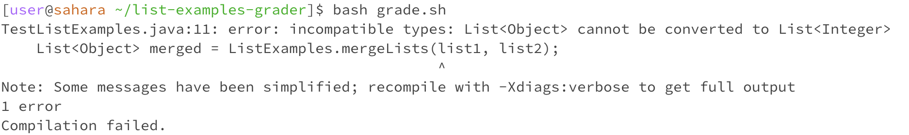
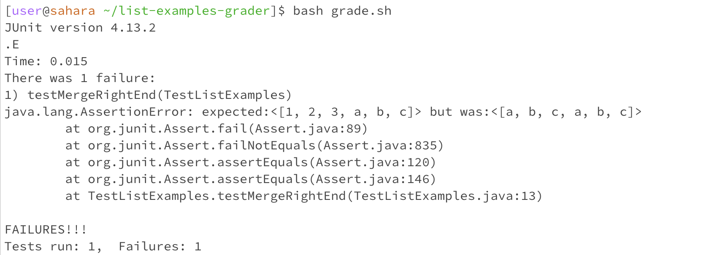
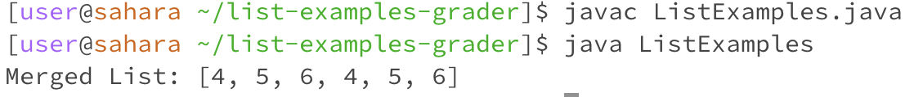

# Lab Report 5
## Part 1


### Student


> Hello, I'm facing an issue with my `ListExamples.java` file. When I run my `grade.sh` script for grading a Java assignment using `TestListExamples.java`, it fails during compilation.
> Can you help me troubleshoot this?"


``` I ran bash grade.sh ```




### TA 

> Your `ListExamples.java` issue seems to be a type mismatch. To combine integers and strings in one list, I recommend using `List<Object>`. This allows any object type but be cautious, as it reduces type safety.

### Student

> Thank you this fixed my error compiling, I needed to use Object to have a more generic type to handle integers and Strings but there is still an issue when I run `bash grade.sh` it says that the test failed even though I am sure that my Test makes sense, is there anything I could do to trace back to this issue?




### TA

>  An easy way to figure out what is wrong with your code is to compile your `ListExamples.java` file, you can do that by running the command,

```
javac ListExamples.java
java ListExamples
```
> I also recommend putting print statements to understand what your `ListExamples.java` file's output is.


### Student


> Thank you that helped a lot! I found out that my ListExamples.java was not modifying the list correctly. After compiling the file and running it this is the output I got, I can clearly see that the array isnt the array I was expected there to be.




### The file and directory needed

```
[user@sahara ~]$ tree
.
└── list-examples-grader
    ├── grade.sh
    ├── lib
    │   ├── hamcrest-core-1.3.jar
    │   └── junit-4.13.2.jar
    ├── ListExamples.class
    ├── ListExamples.java
    ├── TestListExamples.class
    └── TestListExamples.java

3 directories, 7 files

```

> From the home directory of edstem we can see that there is a directory called list-examples-grader that contains all the files after such as ListExamples.java which Merges lists and TestListExamples.java that has special test cases to see if ListExamples.java is correctly implemented. I also have the lib folder that contains the reference to run junit tests and my grade.sh file that tests ListExamples.java using TestListExamples.java


### My code before fixing the type issue.


> TestListExamples.java


```
import static org.junit.Assert.*;
import org.junit.*;
import java.util.Arrays;
import java.util.List;

public class TestListExamples {
  @Test
  public void testMergeRightEnd() {
    List<Object> list1 = Arrays.asList(1, 2, 3);
    List<Object> list2 = Arrays.asList("a", "b", "c");
    List<Object> merged = ListExamples.mergeLists(list1, list2);
    List<Object> expected = Arrays.asList(1, 2, 3, "a", "b", "c");
    assertEquals(expected, merged);
  }
}
```

> ListExamples.java

```
import java.util.ArrayList;
import java.util.List;

public class ListExamples {

    public static List<Integer> mergeLists(List<Integer> list1, List<Integer> list2) {
        List<Integer> mergedList = new ArrayList<>();
        for (int i = 0; i < list1.size(); i++) {
            mergedList.add(list1.get(i) + list2.size());
        }
        for (int j = 0; j < list2.size(); j++) {
            mergedList.add(list2.get(j));
        }
        return mergedList;
    }

    public static void main(String[] args) {
        List<Integer> list1 = List.of(1, 2, 3);
        List<Integer> list2 = List.of(4, 5, 6);
        System.out.println("Merged List: " + mergeLists(list1, list2));
    }
}
```

> grade.sh 

```
CPATH=".:lib/hamcrest-core-1.3.jar:lib/junit-4.13.2.jar"
javac -cp "$CPATH" ListExamples.java TestListExamples.java

if [ $? -eq 0 ]; then
    java -cp "$CPATH" org.junit.runner.JUnitCore TestListExamples
else
    echo "Compilation failed."
fi
```

### My code before fixing the logic of my ListExamples.java 


> TestListExamples.java


```
import static org.junit.Assert.*;
import org.junit.*;
import java.util.Arrays;
import java.util.List;

public class TestListExamples {
  @Test
  public void testMergeRightEnd() {
    List<Object> list1 = Arrays.asList(1, 2, 3);
    List<Object> list2 = Arrays.asList("a", "b", "c");
    List<Object> merged = ListExamples.mergeLists(list1, list2);
    List<Object> expected = Arrays.asList(1, 2, 3, "a", "b", "c");
    assertEquals(expected, merged);
  }
}
```

> ListExamples.java

```
import java.util.ArrayList;
import java.util.List;

public class ListExamples {

    public static List<Object> mergeLists(List<Object> list1, List<Object> list2) {
        List<Object> mergedList = new ArrayList<>();
        
        mergedList.addAll(list2);
        mergedList.addAll(list2);
        
        return mergedList;
    }

    public static void main(String[] args) {
        List<Object> list1 = List.of(1, 2, 3);
        List<Object> list2 = List.of(4, 5, 6);
    }
}
```

> grade.sh 

```
CPATH=".:lib/hamcrest-core-1.3.jar:lib/junit-4.13.2.jar"
javac -cp "$CPATH" ListExamples.java TestListExamples.java

if [ $? -eq 0 ]; then
    java -cp "$CPATH" org.junit.runner.JUnitCore TestListExamples
else
    echo "Compilation failed."
fi
```

### The command line that triggered the Error: 

```
[user@sahara ~/list-examples-grader]$ bash grade.sh
```

> This was the command I used to run my grade.sh file which caused the error. It used the TestListExamples.java to discover this error.


```
[user@sahara ~/list-examples-grader]$ javac ListExamples.java
[user@sahara ~/list-examples-grader]$ javac ListExamples
```

> This was the command I used to compile `ListExamples.java` and understand that my list was incorrectly adding the same list twice.

### This is my code after


```
import static org.junit.Assert.*;
import org.junit.*;
import java.util.Arrays;
import java.util.List;

public class TestListExamples {
  @Test
  public void testMergeRightEnd() {
    List<Object> list1 = Arrays.asList(1, 2, 3);
    List<Object> list2 = Arrays.asList("a", "b", "c");
    List<Object> merged = ListExamples.mergeLists(list1, list2);
    List<Object> expected = Arrays.asList(1, 2, 3, "a", "b", "c");
    assertEquals(expected, merged);
  }
}
```


> ListExamples.java


```
import java.util.ArrayList;
import java.util.List;

public class ListExamples {

    public static List<Object> mergeLists(List<Object> list1, List<Object> list2) {
        List<Object> mergedList = new ArrayList<>();
        
        mergedList.addAll(list1);
        mergedList.addAll(list2);
        
        return mergedList;
    }

    public static void main(String[] args) {
        List<Object> list1 = List.of(1, 2, 3);
        List<Object> list2 = List.of(4, 5, 6);
        System.out.println("Merged List: " + mergeLists(list1, list2));
    }
}


```

> grade.sh 

```
CPATH=".:lib/hamcrest-core-1.3.jar:lib/junit-4.13.2.jar"
javac -cp "$CPATH" ListExamples.java TestListExamples.java

if [ $? -eq 0 ]; then
    java -cp "$CPATH" org.junit.runner.JUnitCore TestListExamples
else
    echo "Compilation failed."
fi
```


> This was my code after I fixed ListExamples.java , as you can see the file will now run appropriately which will make it pass the test fine.

### Edits I did to my code:

> I took away the `for` loops that modified incorrectly my list1

> Fixed my `addAll` method so it doesnt add the same list twice

> I used the `addAll` method to add all of list1 elements first and then list2 elements second so they are in order


## Part 2

During my recent labs i was amazed by how powerful a bash script could be, I didnt know it could run all these commands in the terminal directly, this could make a lot of my future work a lot more efficient if I was trying to automate something a file to run commands in my terminal. I also believe that my markdown skills are quite on point after doing my lab reports and learning how to use github will be very useful for the future. However the issue with these bash scripts are how precise you have to be with your syntax which can be quite frustrating if you do not have a lot practice ie: adding a space after a bracket. Thank you!
