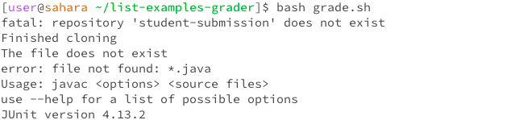

# Lab Report 5

> Hello, I'm a student in CSE 15L and I'm facing some trouble with my code. When I try to run my grade.sh script, it doesn't work as expected. I believe the issue might be related to the script itself, but I'm not entirely sure what's going wrong.
> Here's what I think happens: I run the script to grade a Java assignment, but it seems to fail during the compilation stage. I'm guessing there could be something wrong with the way I'm handling file paths or dependencies in the script, but I can't pinpoint the exact problem. Can someone help me figure out what's causing this issue?

