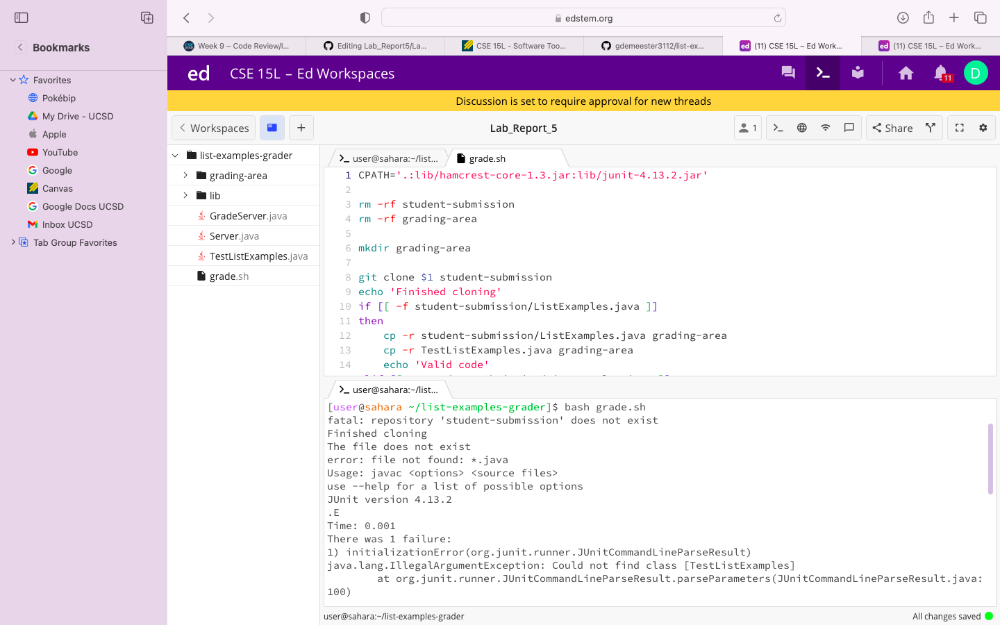

# Lab Report 5

> Hello I am a student from CSE 15L and I am slightly confused because my code doesn't work. Here is the symptom, I guess the bug comes from when I try and run my grade.sh file but I dont really know what is going on.

