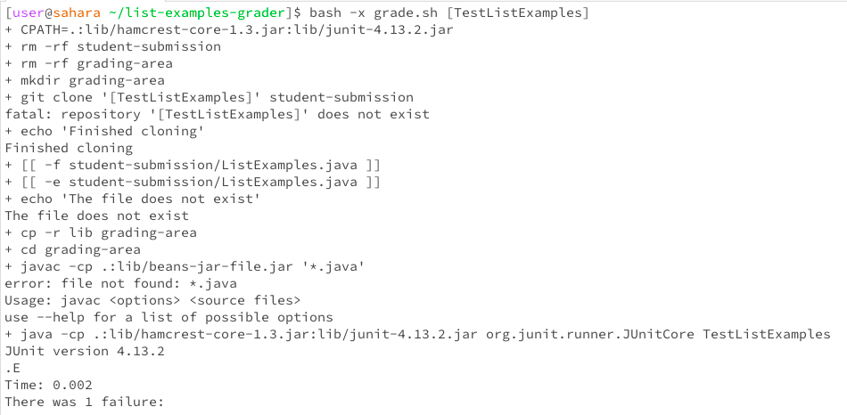

# Lab Report 5
## Part 1

> Hello, I'm a student in CSE 15L and I'm facing some trouble with my code. When I try to run my grade.sh script, it doesn't work as expected. I believe the issue might be related to the script itself, but I'm not entirely sure what's going wrong.
> Here's what I think happens: I run the script to grade a Java assignment, but it seems to fail during the compilation stage. I'm guessing there could be something wrong with the way I'm handling file paths or dependencies in the script, but I can't pinpoint the exact problem. Can someone help me figure out what's causing this issue?

``` I ran bash grade.sh ```


> TA - Hello, keeping your symptom in mind, I recommend double-checking the grade.sh script for any misused file paths or directory references, as these are common sources of errors in such scripts. Here is a command that could help you figure out what the issue is: ` bash -x grade.sh [repository link] `



> Thank you that helped a lot! I found out that there were two bugs in my grade.sh file, the fist one was that I was that I was referencing a jar file that was not in my lib and the second one was that I was trying to copy a nonexistant file to the grading-area.


### The file and directory needed

```
[user@sahara ~]$ tree
.
└── list-examples-grader
    ├── GradeServer.java
    ├── grade.sh
    ├── grading-area
    │ └── lib
    │     ├── hamcrest-core-1.3.jar
    │     └── junit-4.13.2.jar
    ├── lib
    │ ├── hamcrest-core-1.3.jar
    │ └── junit-4.13.2.jar
    ├── Server.java
    └── TestListExamples.java

5 directories, 8 files

```

> From the home directory of edstem we can see that there is a directory called list-examples-grader that contains all the files after running bash grade.sh


### My code before


> This was my grade.sh file before I implemeted the changes I will only be showing this file as it is the only one that induces errors.

### The command line that triggered the bug: 


> This was the command I ran to run my grade.sh file which caused a bug

### This is my code after


> This was my code after I fixed my grade.sh, as you can see the file will now run appropriately with my lib which will make it compile fine, and i do not have a nonexistant file which is getting copied to grading-area.

### Edits I did to my code:

> I remove the 14th line of my code that was copy a nonexistant file to grading-area

> I edited the 24th line from

> `javac -cp ' .:lib/beans-jar-file.jar' *.java ` ---->

> `javac -cp '.:lib/hamcrest-core-1.3.jar:lib/junit-4.13.2.jar' *.java `

## Part 2

During my recent labs i was amazed by how powerful a bash script could be, I didnt know it could run all these commands in the terminal directly, this could make a lot of my future work a lot more efficient if I was trying to automate something a file to run commands in my terminal. I also believe that my markdown skills are quite on point after doing my lab reports. However the issue with these bash scripts are how precise you have to be with your syntax which can be quite frustrating if you do not have a lot practice ie: adding a space after a bracket. Thank you!
