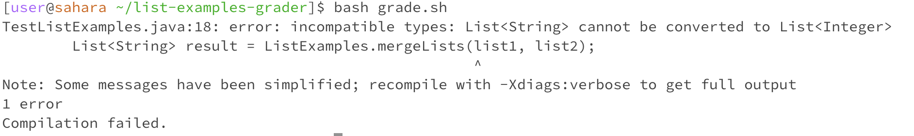

# Lab Report 5
## Part 1


### Student


> Hello, I'm facing an issue with my `ListExamples.java` file. When I run my `grade.sh` script for grading a Java assignment using `ListExamples.java`, it fails during compilation.
> Can you help me troubleshoot this?"


``` I ran bash grade.sh ```





### TA


>  An easy way to figure out what is wrong with your code is to compile your `ListExamples.java` file, you can do that by running the command,

```
javac ListExamples.java
java ListExamples

```
> I also recommend putting print statements to understand what your `ListExamples.java` file's output is.


### Student


> Thank you that helped a lot! I found out that my ListExamples.java was not modifying the list correctly. After compiling the file and running it this is the output I got, I can clearly see that the array isnt the array I was expected there to be.


### The file and directory needed

```
[user@sahara ~]$ tree
.
└── list-examples-grader
    ├── grade.sh
    ├── lib
    │   ├── hamcrest-core-1.3.jar
    │   └── junit-4.13.2.jar
    ├── ListExamples.class
    ├── ListExamples.java
    ├── TestListExamples.class
    └── TestListExamples.java

3 directories, 7 files

```

> From the home directory of edstem we can see that there is a directory called list-examples-grader that contains all the files after such as ListExamples.java which Merges lists and TestListExamples.java that has special test cases to see if ListExamples.java is correctly implemented. I also have the lib folder that contains the reference to run junit tests and my grade.sh file that tests ListExamples.java with TestListExamples.java


### My code before


> This was my grade.sh file before I implemeted the changes I will only be showing this file as it is the only one that induces errors.

### The command line that triggered the bug: 


> This was the command I ran to run my grade.sh file which caused a bug

### This is my code after


> This was my code after I fixed my grade.sh, as you can see the file will now run appropriately with my lib which will make it compile fine, and i do not have a nonexistant file which is getting copied to grading-area.

### Edits I did to my code:

> I remove the 14th line of my code that was copy a nonexistant file to grading-area

> I edited the 24th line from

> `javac -cp ' .:lib/beans-jar-file.jar' *.java ` ---->

> `javac -cp '.:lib/hamcrest-core-1.3.jar:lib/junit-4.13.2.jar' *.java `

## Part 2

During my recent labs i was amazed by how powerful a bash script could be, I didnt know it could run all these commands in the terminal directly, this could make a lot of my future work a lot more efficient if I was trying to automate something a file to run commands in my terminal. I also believe that my markdown skills are quite on point after doing my lab reports. However the issue with these bash scripts are how precise you have to be with your syntax which can be quite frustrating if you do not have a lot practice ie: adding a space after a bracket. Thank you!
